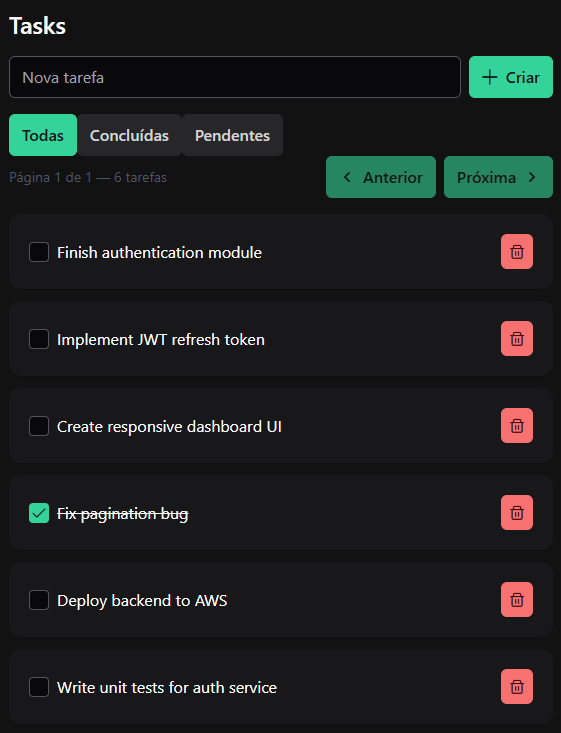

# Task Manager Web

## Resumo do projeto

Task Manager Web é uma aplicação front-end em Angular que demonstra rotas, autenticação simples, chamadas HTTP e gerenciamento de tarefas. Foi desenvolvida para mostrar habilidades práticas em desenvolvimento SPA com TypeScript, Angular e bibliotecas de UI.

## Principais funcionalidades

- Autenticação básica (módulo `auth`).
- CRUD de tarefas (módulo `tasks`).
- Interceptadores e guards para proteção de rotas.
- Arquitetura modular e separação entre serviços, componentes e rotas.

## Stack tecnológica

- Angular (v21.x)
- TypeScript
- PrimeNG / PrimeIcons (UI)
- TailwindCSS / PostCSS (estilos)
- Express (SSR - server-side rendering)
- Karma / Jasmine e Vitest (testes)

Versões e scripts principais (extraídos de `package.json`):

- `start`: `ng serve` — rodar em modo desenvolvimento.
- `build`: `ng build` — gerar build de produção.
- `watch`: `ng build --watch --configuration development` — watch de desenvolvimento.
- `test`: `ng test` — executar testes unitários (Karma/Jasmine).
- `serve:ssr:task-manager-web`: `node dist/task-manager-web/server/server.mjs` — servir versão SSR.

## Instalação (rápido)

Pré-requisitos:

- Node.js (recomendado: 18+)
- npm (ou use `npm` conforme `packageManager`)

Passos:

```bash
# instalar dependências
npm install

# rodar em desenvolvimento
npm start
```

Para gerar build de produção:

```bash
npm run build
```

Para servir a versão SSR (após build do servidor):

```bash
# construir e então
npm run serve:ssr:task-manager-web
```

## Testes

Executar testes unitários (Karma/Jasmine):

```bash
npm test
```


## Estrutura do projeto (resumo)

- `src/app/` — código da aplicação.
  - `auth/` — módulo e serviços de autenticação.
  - `core/` — guards, interceptors e utilitários.
  - `tasks/` — serviço e componentes de tarefas.
- `server.ts`, `main.server.ts` — arquivos para SSR.

## O que destacar no portfólio

### Arquitetura modular

O módulo `auth` concentra toda a lógica de autenticação (componentes de login, serviços que gerenciam tokens e estado do usuário), o módulo `core` agrupa funcionalidades transversais como `guards`, `interceptors` e utilitários reutilizáveis, e o módulo `tasks` contém a lógica de negócio para criação, listagem, edição e remoção de tarefas (componentes, templates e `TasksService`). Essa separação melhora a manutenibilidade, facilita testes unitários isolados, permite reuso de código e torna a aplicação mais fácil de entender por outros desenvolvedores ou recrutadores.

### Segurança e testes

`AuthGuard` para restringir rotas a usuários autenticados; `AuthInterceptor` para anexar tokens às requisições HTTP, tratar respostas 401/403 e centralizar tratamento de erros. Testes de unidade para serviços (mock de `HttpClient`), testes para guards (mock de `AuthService`) e specs para componentes críticos usando Jasmine/Karma.

# Preview
## Login


## Tasks
